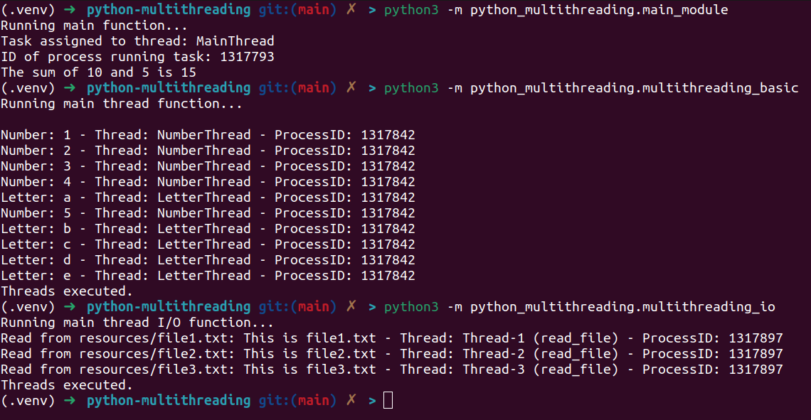
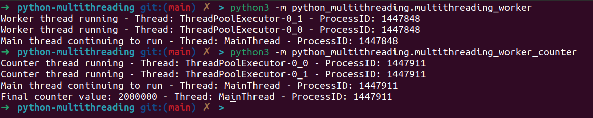
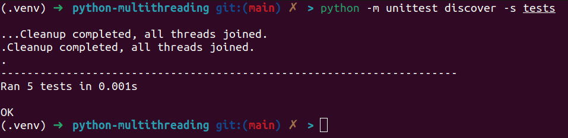

# Python Multi-threading


Python multi-threading tests and examples.

## Installation

```sh
pip install -r requirements.txt
```

## How to run it

To run the functions:

```sh
python3 -m python_multithreading.main_module
python3 -m python_multithreading.multithreading_standard
python3 -m python_multithreading.multithreading_io
python3 -m multithreading_worker
python3 -m multithreading_worker_counter
```



To run all the tests in directory 'tests':

```sh
python -m unittest discover -s tests
```


## Examples

* [main_module.py](python_multithreading/main_module.py): The basic thread test.
* [multithreading_standard.py](python_multithreading/multithreading_basic.py): It runs many standard threads.
* [multithreading_io.py](python_multithreading/multithreading_io.py): It performs I/O operations, reading files in a multi-threading context.
* [multithreading_worker.py](python_multithreading/multithreading_worker.py): It implements a basic ThreadPool with Workers.
* [multithreading_worker_counter.py](python_multithreading/multithreading_worker_counter.py): A counter ThreadPool with Workers synchronizing and locking.

## Author

- Wallace Espindola, Sr. Software Engineer / Java & Python Dev
- **LinkedIn:** [linkedin.com/in/wallaceespindola/](https://www.linkedin.com/in/wallaceespindola/)
- **GitHub:** [github.com/wallaceespindola](https://github.com/wallaceespindola)
- **E-mail:** [wallace.espindola@gmail.com](mailto:wallace.espindola@gmail.com)
- **Twitter:** [@wsespindola](https://twitter.com/wsespindola)
- **Gravatar:** [gravatar.com/wallacese](https://gravatar.com/wallacese)
- **Dev Community:** [dev.to/wallaceespindola](https://dev.to/wallaceespindola)
- **DZone Articles:** [DZone Profile](https://dzone.com/users/1254611/wallacese.html)
- **Pulse Articles:** [LinkedIn Articles](https://www.linkedin.com/in/wallaceespindola/recent-activity/articles/)
- **Website:** [W-Tech IT Solutions](https://www.wtechitsolutions.com/)
- **Presentation Slides:** [Speakerdeck](https://speakerdeck.com/wallacese)

## License

- This project is released under the Apache 2.0 License.
- See the [LICENSE](LICENSE) file for details.
- Copyright © 2024 [Wallace Espindola](https://github.com/wallaceespindola/).
